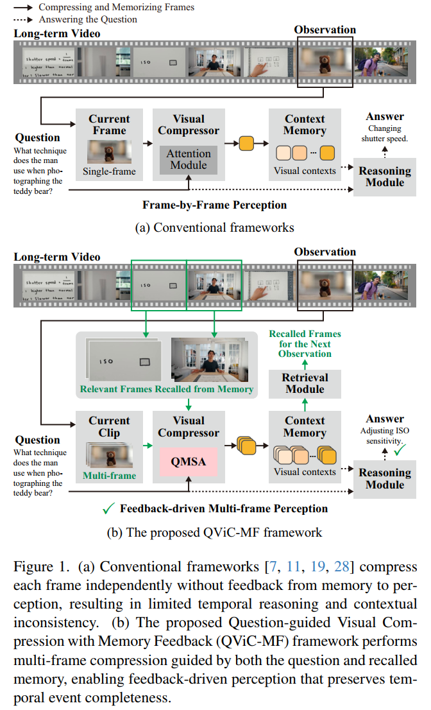
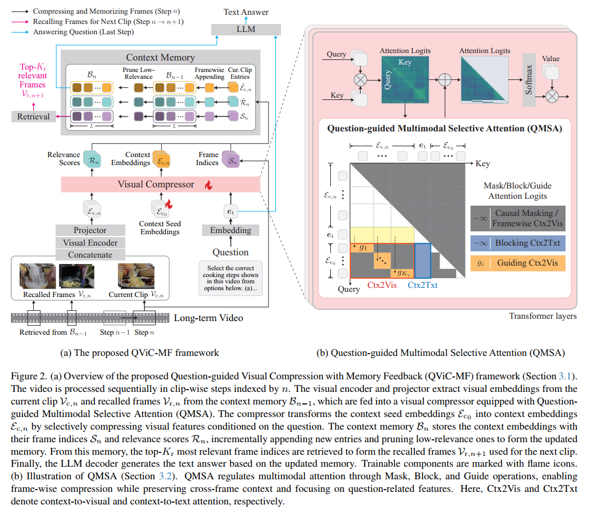

# Question-guided Visual Compression with Memory Feedback for Long-Term Video Understanding

[](https://arxiv.org/abs/2603.15167)
[](https://cvpr.thecvf.com/)

The official repository for the paper **Question-guided Visual Compression with Memory Feedback for Long-Term Video Understanding** (CVPR 2026).

Sosuke Yamao\*, Natsuki Miyahara\*, Yuankai Qi, Shun Takeuchi (Fujitsu Research / Macquarie University)

\*Equal contribution

<!--
<p align="center">
  
  &nbsp;&nbsp;
  
</p>
-->
<p align="center">
  
</p>

## News

- **[2026.03]** Paper accepted to CVPR 2026. [[arXiv]](https://arxiv.org/abs/2603.15167)
- Code will be released soon.

## Abstract

In the context of long-term video understanding with large multimodal models, many frameworks have been proposed. Although transformer-based visual compressors and memory-augmented approaches are often used to process long videos, they usually compress each frame independently and therefore fail to achieve strong performance on tasks that require understanding complete events, such as temporal ordering tasks in MLVU and VNBench. This motivates us to rethink the conventional one-way scheme from perception to memory, and instead establish a feedback-driven process in which past visual contexts stored in the context memory can benefit ongoing perception. To this end, we propose **Question-guided Visual Compression with Memory Feedback (QViC-MF)**, a framework for long-term video understanding. At its core is a **Question-guided Multimodal Selective Attention (QMSA)**, which learns to preserve visual information related to the given question from both the current clip and the past related frames from the memory. The compressor and memory feedback work iteratively for each clip of the entire video. This simple yet effective design yields large performance gains on long-term video understanding tasks. Extensive experiments show that our method achieves significant improvement over current state-of-the-art methods by **6.1%** on MLVU test, **8.3%** on LVBench, **18.3%** on VNBench Long, and **3.7%** on VideoMME Long.

## Citation

If you find this work useful, please cite:

```bibtex
@inproceedings{yamao2026qvicmf,
  title={Question-guided Visual Compression with Memory Feedback for Long-Term Video Understanding},
  author={Yamao, Sosuke and Miyahara, Natsuki and Qi, Yuankai and Takeuchi, Shun},
  booktitle={Proceedings of the IEEE/CVF Conference on Computer Vision and Pattern Recognition (CVPR)},
  year={2026}
}
```